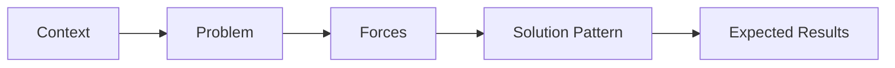
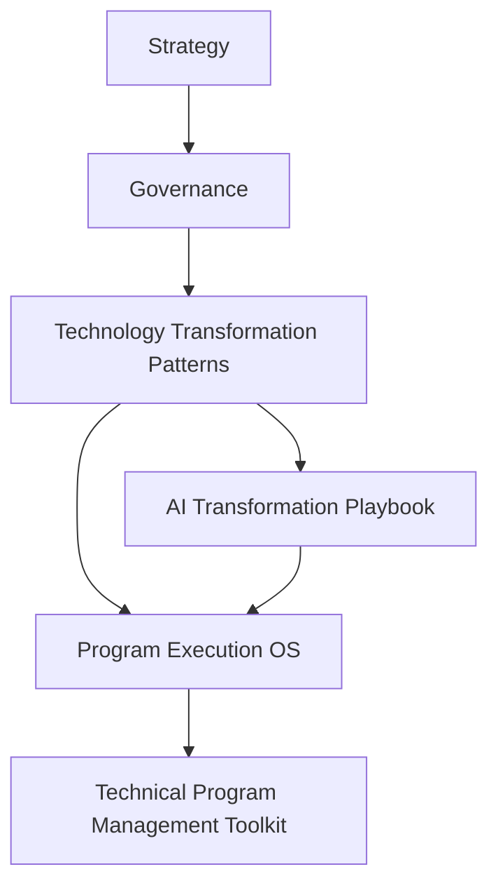

# Technology Transformation Patterns

> **Author:** Somer Walker  
> Creator of the **Transformation Operating Framework**, a model for aligning strategy, governance, and program execution in complex organizations.

This repository documents a collection of practical patterns for leading large-scale technology transformation initiatives.

Technology transformation efforts often follow recurring structural patterns. While organizations may approach them differently, the underlying challenges and solution approaches tend to repeat across industries.

This repository captures those recurring patterns and documents practical approaches for navigating common transformation scenarios.

---

## Part of the Transformation Operating Framework

This repository is a supporting component of the **Transformation Operating Framework**, a layered model for aligning strategy, governance, transformation initiatives, and execution across complex organizations.

The master framework repository provides the conceptual architecture connecting the various supporting modules.

Transformation Operating Framework  
https://github.com/somerwalker/transformation-operating-framework

---

## Why Technology Transformation Patterns Matter

Technology transformations rarely occur in completely unique situations. Most organizations encounter similar structural challenges when evolving their technology platforms or operating models.

Common transformation scenarios include:

- modernizing legacy systems  
- migrating infrastructure to cloud platforms  
- consolidating fragmented platforms  
- adopting AI and data-driven capabilities  
- shifting operating models to support new technologies  

Recognizing these recurring patterns helps leaders anticipate risks, select appropriate approaches, and coordinate transformation initiatives more effectively.

---

## Repository Model

Each transformation pattern in this repository follows a consistent structure.

This structure defines the format used for documenting transformation patterns within the repository. It ensures that each pattern clearly explains the conditions in which the pattern applies, the forces influencing the situation, the structural solution used, and the results organizations should expect.

By using a consistent model, organizations can more easily compare transformation approaches, identify risks, and apply proven patterns across different initiatives.

---

## Repository Contents

### 📘 Transformation Patterns

| File | Description |
|-----|-------------|
| patterns/1-legacy-modernization.md | Pattern for evolving legacy systems while maintaining operational continuity |
| patterns/2-cloud-migration.md | Pattern for migrating infrastructure and applications to cloud environments |
| patterns/3-platform-consolidation.md | Pattern for reducing system fragmentation through platform consolidation |
| patterns/4-ai-adoption.md | Pattern for introducing AI capabilities into existing organizational workflows |
| patterns/5-operating-model-shift.md | Pattern for evolving organizational structures to support new technologies |

### 🧰 Templates

| File | Description |
|-----|-------------|
| templates/transformation-pattern-template.md | Template for documenting new transformation patterns |

---

## How This Repository Helps Organizations

Understanding transformation patterns helps organizations:

- recognize recurring structural challenges  
- understand the approaches used to address them  
- learn from patterns observed across multiple transformation efforts  
- accelerate decision-making during complex initiatives  

These patterns provide practical guidance for structuring large-scale technology change. Rather than approaching every transformation as a completely unique problem, organizations can apply proven structural patterns to guide planning and execution.

---

## Relationship to the Transformation Operating Framework

Within the Transformation Operating Framework, transformation patterns describe the organizational and technical structures used to implement change. They bridge the gap between governance decisions and program execution by providing practical models for transformation initiatives. 

This repository defines the transformation patterns that guide strategic technology transformation decisions within the Strategy layer of the Transformation Operating Framework.

See the architecture overview:  
https://github.com/somerwalker/transformation-operating-framework

---
---

## Intellectual Property

The frameworks and methodologies documented in this repository are original work created by Somer Walker as part of the **Transformation Operating Framework**.

This repository provides conceptual documentation, examples, and templates for educational and professional reference.

Commercial use of the methodology or derivative consulting frameworks requires written permission from the author.

## Author

Somer Walker  
Enterprise Program Leader | Operational Excellence | AI Transformation

LinkedIn  
https://www.linkedin.com/in/somerwalker

## Contributing

Suggestions, improvements, and additional examples are welcome.  
Please review `CONTRIBUTING.md` before submitting a pull request.

## Copyright

Copyright © 2026 Somer Walker
