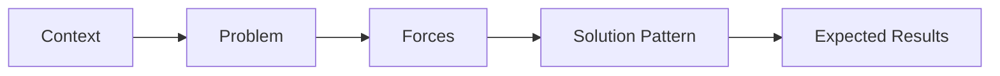
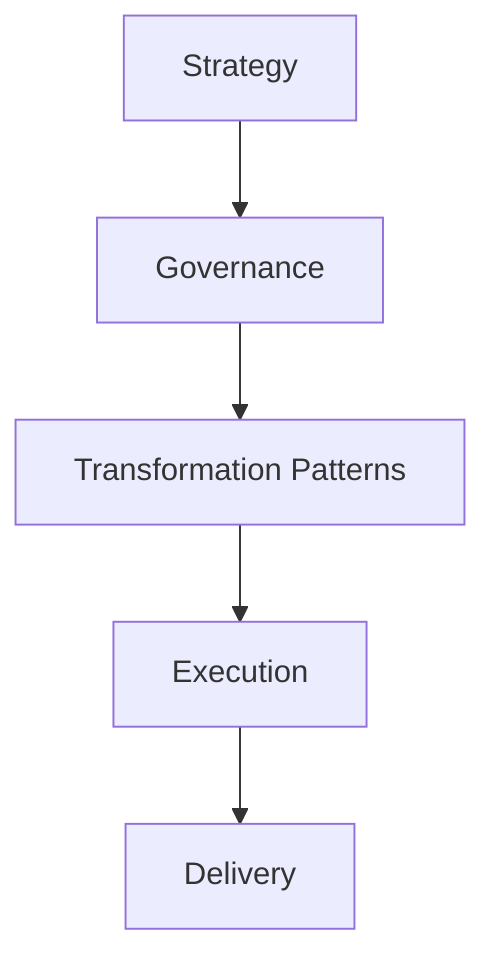

# Technology Transformation Patterns

A collection of practical patterns for leading large-scale technology transformation initiatives.

Technology transformation efforts often follow recurring structural patterns. Organizations may approach them differently, but the underlying challenges and solution approaches tend to repeat across industries.

This repository captures those recurring patterns and describes practical approaches for navigating common transformation scenarios.

---

## Why Transformation Patterns Matter

Technology transformations rarely occur in completely unique situations. Most organizations encounter similar structural challenges when evolving their technology platforms or operating models.

Common examples include:

- modernizing legacy systems  
- migrating infrastructure to cloud platforms  
- consolidating fragmented platforms  
- adopting AI and data-driven capabilities  
- shifting operating models to support new technologies  

Recognizing these patterns helps leaders anticipate risks, select appropriate approaches, and coordinate transformation initiatives more effectively.

---

## Transformation Pattern Model

Each pattern in this repository follows a consistent structure:

This structure helps transformation leaders understand not only the solution approach but also the conditions that make a particular pattern effective.

---

## Repository Contents

### 📘 Transformation Patterns

| File | Description |
|-----|-------------|
| patterns/1-legacy-modernization.md | Pattern for evolving legacy systems while maintaining operational continuity |
| patterns/2-cloud-migration.md | Pattern for migrating infrastructure and applications to cloud environments |
| patterns/3-platform-consolidation.md | Pattern for reducing system fragmentation through platform consolidation |
| patterns/4-ai-adoption.md | Pattern for introducing AI capabilities into existing organizational workflows |
| patterns/5-operating-model-shift.md | Pattern for evolving organizational structures to support new technologies |

---

### 🧰 Templates

| File | Description |
|-----|-------------|
| templates/transformation-pattern-template.md | Template for documenting new transformation patterns |

---

## How This Repository Helps Organizations

Understanding transformation patterns helps organizations:

- recognize recurring structural challenges  
- evaluate different transformation approaches  
- coordinate initiatives across multiple teams  
- anticipate risks associated with technology change  
- design transformation strategies with greater confidence  

Rather than approaching every transformation as a unique problem, organizations can apply proven patterns to guide decision-making.

---

## Relationship to the Transformation Operating System

This repository is part of the broader **Transformation Operating System** framework.

The Transformation Operating System connects several complementary frameworks:

See the architecture overview:  
https://github.com/somerwalker/transformation-operating-system

---

## Contributing

Contributions and suggestions are welcome. If you have ideas for additional transformation patterns or improvements to existing ones, please review the guidelines in `CONTRIBUTING.md` before submitting a proposal.

---

## Author

**Somer Walker**  
Enterprise Program Leader | AI Transformation | Operational Excellence

Background leading complex infrastructure, cloud, and AI initiatives across global organizations, focused on turning strategy into disciplined execution.

LinkedIn  
https://www.linkedin.com/in/somerwalker