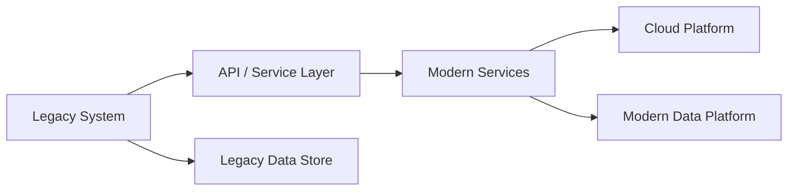
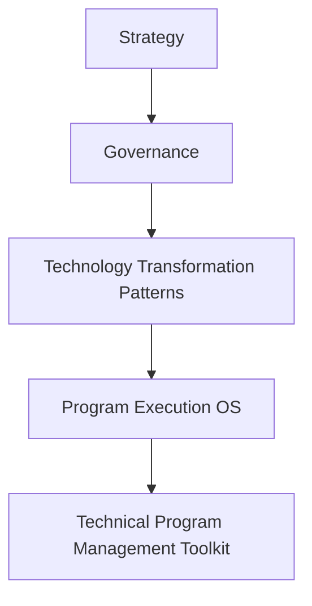

# Legacy Modernization Pattern

This pattern describes how organizations modernize legacy systems while maintaining operational continuity.

This pattern is part of the **Transformation Operating Framework**, which connects strategy, governance, transformation patterns, execution, and delivery.

---

## Context

Organizations rely on legacy systems that are deeply embedded in business operations.

These systems often:

- support critical processes
- contain significant technical debt
- are difficult to scale or modify

Despite these limitations, they cannot be replaced abruptly due to operational risk.

---

## Problem

Direct replacement of legacy systems introduces unacceptable disruption.

Organizations struggle to modernize systems while maintaining stability and continuity of operations.

---

## Forces

Several forces shape legacy modernization efforts:

- operational continuity requirements  
- regulatory and compliance constraints  
- limited documentation of legacy systems  
- complex system dependencies  
- limited engineering capacity  

---

## Solution Pattern

Successful legacy modernization typically follows an incremental approach:

1. identify critical legacy capabilities  
2. isolate system boundaries and interfaces  
3. introduce service or API layers  
4. gradually migrate functionality to modern platforms  
5. retire legacy components over time  

This phased approach allows modernization while preserving operational stability.

---

## Expected Results

When applied successfully, this pattern results in:

- improved system maintainability  
- reduced technical debt  
- increased platform scalability  
- lower operational risk during transformation  

---

### Example Architecture

The diagram below illustrates a simplified structure commonly used during legacy modernization efforts.

---

## Relationship to the Transformation Operating Framework

Legacy modernization represents a common **Transformation Pattern** within the broader Transformation Operating Framework.

Transformation patterns describe the structural approaches organizations use to implement large-scale technology change. These patterns guide transformation decisions in the Strategy layer that influence program execution and delivery.

---
---

Part of the **Transformation Operating Framework**
Transformation Operating Framework
https://github.com/somerwalker/transformation-operating-framework

Copyright © 2026 Somer Walker

This material is provided for educational and professional reference.  
Commercial use or derivative consulting frameworks requires permission from the author.
