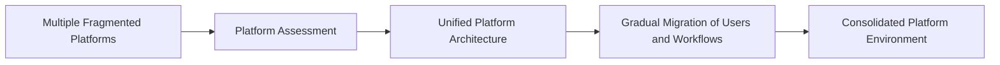
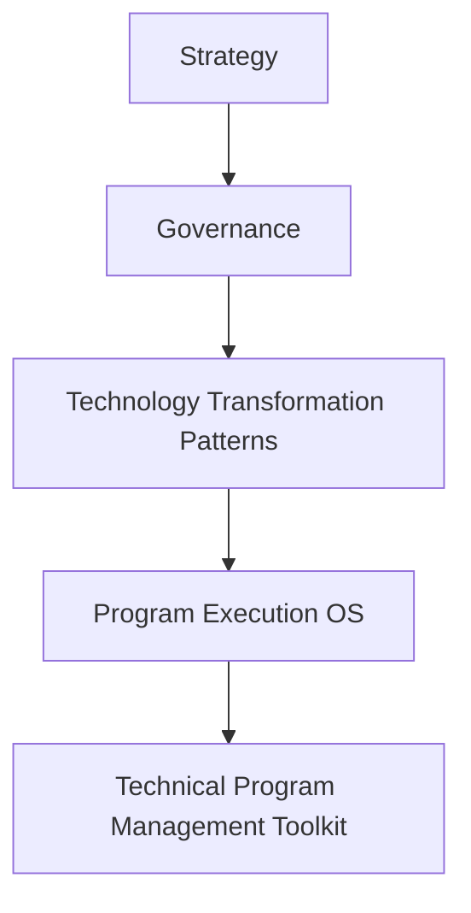

# Platform Consolidation Pattern

This pattern describes how organizations consolidate fragmented technology platforms to improve operational efficiency.

---

## Context

Over time, organizations accumulate multiple overlapping systems performing similar functions.

This fragmentation leads to:

- duplicated capabilities
- inconsistent processes
- high operational overhead

---

## Problem

Fragmented platforms increase operational complexity and reduce organizational efficiency.

Organizations struggle to maintain and integrate multiple systems.

---

## Forces

Platform consolidation efforts must balance:

- system compatibility constraints  
- stakeholder ownership of existing systems  
- migration risk  
- operational continuity  

---

## Solution Pattern

Platform consolidation typically involves:

1. inventory existing platforms  
2. evaluate functional overlap  
3. identify consolidation targets  
4. design a unified platform architecture  
5. migrate users and workflows gradually  

---

## Expected Results

Platform consolidation often results in:

- reduced operational complexity  
- improved system integration  
- lower maintenance costs  
- improved user experience  

## Relationship to the Transformation Operating Framework

Platform consolidation represents a common **Transformation Pattern** within the Transformation Operating Framework.

---
---

Part of the **Transformation Operating Framework**

Transformation Operating Framework
https://github.com/somerwalker/transformation-operating-framework

Copyright © 2026 Somer Walker

This material is provided for educational and professional reference.  
Commercial use or derivative consulting frameworks requires permission from the author.
