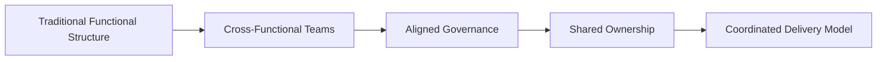
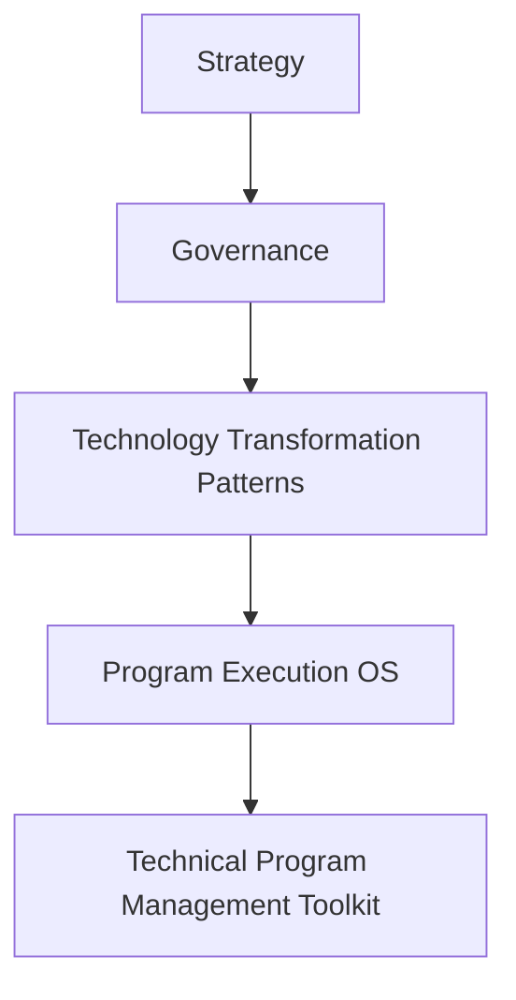

# Operating Model Shift Pattern

This pattern describes how organizations evolve their operating models to support new technologies and delivery approaches.

---

## Context

Technology transformation often requires changes to organizational structure and decision-making processes.

Traditional operating models may not support modern delivery practices.

---

## Problem

Organizations attempting technology transformation without adjusting their operating models often experience:

- slow decision-making  
- fragmented ownership  
- misaligned incentives  

---

## Forces

Operating model shifts are influenced by:

- leadership structures  
- governance frameworks  
- cultural resistance to change  
- existing organizational hierarchies  

---

## Solution Pattern

Successful operating model shifts typically involve:

1. redefining ownership and accountability  
2. aligning governance with delivery teams  
3. introducing cross-functional collaboration structures  
4. establishing new communication rhythms  
5. reinforcing cultural alignment with new delivery models  

---

## Expected Results

Organizations applying this pattern often achieve:

- faster decision-making  
- stronger cross-team collaboration  
- improved delivery coordination  
- increased organizational agility  

---

## Relationship to the Transformation Operating Framework

Operating model shifts represent a common **Transformation Pattern** within the Transformation Operating Framework. Transformation patterns describe structural approaches organizations use to implement major technology change initiatives and align governance and delivery models with evolving technologies. This repository documents the transformation patterns that operate within the **Patterns layer** of the framework.

---
---

Part of the **Transformation Operating Framework**

Trasformation Operating Framework
https://github.com/somerwalker/transformation-operating-framework

Copyright © 2026 Somer Walker

This material is provided for educational and professional reference.  
Commercial use or derivative consulting frameworks requires permission from the author.
